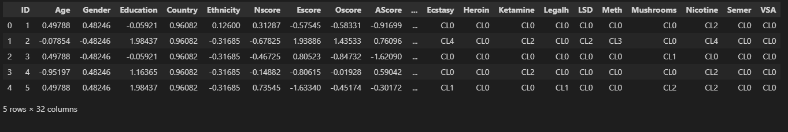
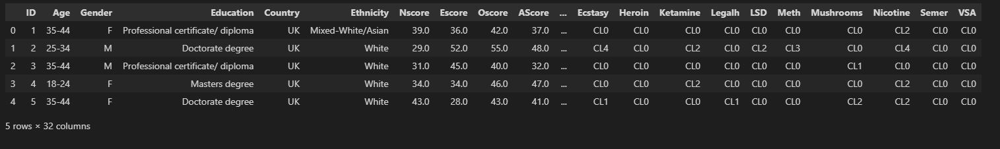
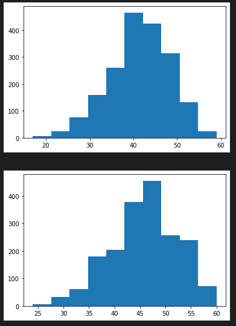
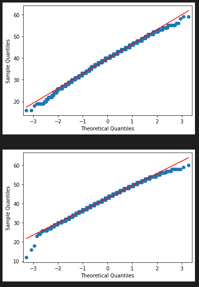
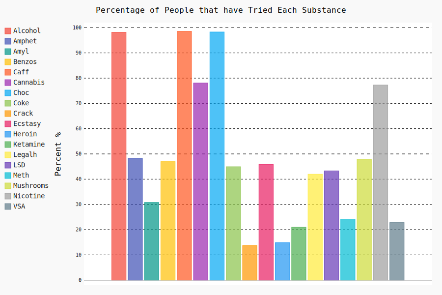

# Predicting-Drug-Use-with-the-Big-Five-Personality-Traits
<p align="justify"> Using machine learning classification models to predict a person's willingness to try illegal drugs based on quantified scores of their personality traits.</p> 
<br/>

# Overview

<p align="justify"> The objective of this project was to study the relationship between the Big Five personality traits and the use of illegal drugs. This was done by testing the significance of trait differences between users and non-users and by creating several machine learning classification models to test the predictive power of the Big Five traits and some other features. In addition, correlations between the use of different drugs were also examined in order to discover any interesting relationships and test the ‘Gateway drug’ theory.</p>
<br/>

# Background

<p align="justify">The Big Five personality trait model was initially developed in 1949 by D. W. Fiske and has grown in popularity over time. The model breaks personality down into five character traits: Openness, Conscientiousness, Extraversion, Agreeableness, and Neuroticism – often abbreviated as OCEAN. The Big Five model has been studied extensively in relation to its predictive power (successfully predicts outcomes relating to personal, interpersonal, social, health etc.), cultural differences, gender differences and personality disorders.</p> 

<p align="justify">Openness describes a person’s willingness to try new experiences, their intellectual curiosity, openness to emotion and creativity. An individual who has high openness is also more likely to engage in risky behaviour. Conscientiousness is represented by high levels of thoughtfulness, impulse control and organization. Extraversion is displayed by those who enjoy interacting with other people, are full of energy, talkative and assertive. Agreeableness reflects an individual’s concern for social harmony, optimistic thinking and their willingness to compromise their own interests for those of others. Neuroticism is associated with emotional instability and those who are high in this trait often experience high levels of sadness, moodiness, anxiety and any other negative feelings.</p> 
<br/>

# Data

The dataset was downloaded from the UCI (University of California Irvine) machine learning repository (link [here](https://archive.ics.uci.edu/ml/datasets/Drug+consumption+%28quantified%29)).

<p align="justify">The data was recorded for 1885 individuals who responded to online surveys. The test for the OCEAN model involves answering a series of questions (typically 40-60 questions) using a scale from 1-5 (1 representing ‘strongly disagree’ and 5 representing strongly agree). The answers are then used to calculate an unitless score for each personality trait.</p>

<p align="justify">In addition to scores for the Big Five personality traits, the data also contains values for age (ranged values, e.g. 18-24), highest educational status, gender, country, ethnicity and two other personality measures labelled as ‘Impulsivity’ and ‘Sensation Seeking’. There are also an additional 18 columns, one for each of the various legal and illegal substances where participants gave one of the following answers: CL0 = Never Used, CL1 = Used over a Decade Ago, CL2 = Used in Last Decade, CL3 = Used in Last Year, CL4 =  Used in Last Month, CL5 = Used in Last Week, CL6 = Used in Last Day.</p>

<p align="justify">These substances were as follows (ordered): alcohol, amphetamines, amyl nitrate, benzodiazepines, caffeine, cannabis, chocolate, cocaine, crack, ecstasy, heroin, ketamine, legal highs, LSD, Methamphetamine, mushrooms, nicotine and volatile substance abuse.</p> 

<p align="justify">The data was imported into Visual Studio Code using Python and the head of the dataset was shown with the following:</p> 

```python
import pandas as pd
import numpy as np
from matplotlib import pyplot as plt
import statistics as stat
from scipy import stats

missing_values = ['na','NA','N/A','n/a']
data = pd.read_csv("drug_consumption.data",header=None, na_values=missing_values)
header_cols = ['ID','Age','Gender','Education','Country','Ethnicity','Nscore','Escore','Oscore','AScore','Cscore',
    'Impulsive','SS','Alcohol','Amphet','Amyl','Benzos','Caff','Cannabis','Choc','Coke','Crack','Ecstasy','Heroin',
    'Ketamine','Legalh','LSD','Meth','Mushrooms','Nicotine','Semer','VSA'
    ]
data.columns = header_cols

data.head()

```

<br/>
<br/>

# Data Pre-Processing
<p align="justify">The first pre-processing task that was completed was checking for missing values. This was done with the following code which found zero missing values.</p>

```python
# Check for missing values
chk = 0
for head in header_cols:
    null_val = data[head].isnull()
    for j in null_val:
        if j == True:
            chk = chk + 1
print(chk)

```

<p align="justify">It should be noted that some data pre-processing was already performed by the original author before the dataset was made available for download. This may or may not have included some data cleaning. What is known for sure is that the pre-processing performed by the author did include at least two steps: handling of categorical variables and feature scaling:</p>


### 1)	Handling of Categorical Variables:
<p align="justify">There are a number of categorical variables in the dataset, namely: age (range), gender, education, country and ethnicity. These were all given numerical values. This was presumably done in a way that intended to avoid one-hot encoding (creating binary data for each categorical option, i.e. 1 or 0) given the number of possible values for each category.</p>

<p align="justify">For example age has six levels (possible values), education has nine, country has seven and ethnicity has seven. If these variables were one-hot encoded there would be 29 columns for just four variables. When dealing with categorical variables that have multiple options like this, having this many dummy columns is often avoided as it may impact the results of the study.</p> 

### 2)	Feature Scaling
<p align="justify">It can be seen by looking the dataset above that some sort of feature scaling was also performed on the data. This appears to be a form of standardization scaling as the data is distributed about a mean of approximately zero. This applies to both categorical and numerical data. Therefore, no feature scaling was needed to be done as part of this project in order to facilitate the predictive modelling section later on.</p> 

### Converting Back to Original Data
<p align="justify">The keys were provided by the authors so that the scaled data can be converted back to the original data. This was partially done for visual/aesthetic purposes but mostly because the original data was used to calculate the descriptive statistics for the Big Five traits. This was not a complete necessity but it was preferred to show the descriptive statistics of the Big Five in a form that was consistent with typical scores. The keys were saved in a file called Dictionaries.xlsx. The converted (original) data can be seen below.</p>

```python
# Dictionaries for categorical variables
Nscore_xl = pd.read_excel('Dictionaries.xlsx', sheet_name = 'Nscores')
Nscore_xl = Nscore_xl.iloc[:, 1:]
Nscore_dict = Nscore_xl.set_index('Score').to_dict()['Value']

Escore_xl = pd.read_excel('Dictionaries.xlsx', sheet_name = 'Escores')
Escore_xl = Escore_xl.iloc[:, 1:]
Escore_dict = Escore_xl.set_index('Score').to_dict()['Value']

Oscore_xl = pd.read_excel('Dictionaries.xlsx', sheet_name = 'Oscores')
Oscore_xl = Oscore_xl.iloc[:, 1:]
Oscore_dict = Oscore_xl.set_index('Score').to_dict()['Value']

Ascore_xl = pd.read_excel('Dictionaries.xlsx', sheet_name = 'Ascores')
Ascore_xl = Ascore_xl.iloc[:, 1:]
Ascore_dict = Ascore_xl.set_index('Score').to_dict()['Value']

Cscore_xl = pd.read_excel('Dictionaries.xlsx', sheet_name = 'Cscores')
Cscore_xl = Cscore_xl.iloc[:, 1:]
Cscore_dict = Cscore_xl.set_index('Score').to_dict()['Value']

Age_xl = pd.read_excel('Dictionaries.xlsx', sheet_name = 'Age')
Age_xl = Age_xl.iloc[:, 1:]
Age_dict = Age_xl.set_index('Score').to_dict()['Value']

Edu_xl = pd.read_excel('Dictionaries.xlsx', sheet_name = 'Education')
Edu_xl = Edu_xl.iloc[:, 1:]
Edu_dict = Edu_xl.set_index('Score').to_dict()['Value']

Country_xl = pd.read_excel('Dictionaries.xlsx', sheet_name = 'Country')
Country_xl = Country_xl.iloc[:, 1:]
Country_dict = Country_xl.set_index('Score').to_dict()['Value']

Eth_xl = pd.read_excel('Dictionaries.xlsx', sheet_name = 'Ethnicity')
Eth_xl = Eth_xl.iloc[:, 1:]
Eth_dict = Eth_xl.set_index('Score').to_dict()['Value']
```

```python
# Convert Scores via Dictionaries to calculate Descriptive Stats
orig_data = data.copy()
for i in range(0, len(data)):
    for keys, values in Nscore_dict.items():
        if orig_data['Nscore'][i] == values:
            orig_data['Nscore'].iat[i] = keys
    for keys, values in Escore_dict.items():
        if orig_data['Escore'][i] == values:
            orig_data['Escore'].iat[i] = keys
    for keys, values in Ascore_dict.items():
        if orig_data['AScore'][i] == values:
            orig_data['AScore'].iat[i] = keys
    for keys, values in Oscore_dict.items():
        if orig_data['Oscore'][i] == values:
            orig_data['Oscore'].iat[i] = keys
    for keys, values in Cscore_dict.items():
        if orig_data['Cscore'][i] == values:
            orig_data['Cscore'].iat[i] = keys
    for keys, values in Age_dict.items():
        if orig_data['Age'][i] == values:
            orig_data['Age'].iat[i] = keys
    for keys, values in Edu_dict.items():
        if orig_data['Education'][i] == values:
            orig_data['Education'].iat[i] = keys
    for keys, values in Country_dict.items():
        if orig_data['Country'][i] == values:
            orig_data['Country'].iat[i] = keys
    for keys, values in Eth_dict.items():
        if orig_data['Ethnicity'][i] == values:
            orig_data['Ethnicity'].iat[i] = keys
    if orig_data['Gender'][i] == 0.48246:
            orig_data['Gender'].iat[i] = 'F'
    else:
         orig_data['Gender'].iat[i] = 'M'
            
orig_data.head()
```



### Splitting the Data & Creating the Response Variable

<p align="justify">The dataset was then copied so that three distinct scenarios could be studied, based on the type of drug user. In each of these three datasets a new variable was created which will be used as the response variable in the predictive modelling section later on. Given the nature of the answers that the respondents gave for each substance (CL0 to CL6 mentioned earlier, i.e. Never tried, Used in Last Decade etc.), it was determined that this would have to be a binary variable (0 or 1) for classification modelling.</p>

<p align="justify">The method used for calculating the output variable was therefore the defining feature that separates the datasets. This was done to investigate any possible differences in predictive power of the Big Five traits for those who are more active users and for those who use more dangerous drugs.</p>

The three datasets were created with the following logic and code:   
### 1) A participant who has tried at least one illegal drug at any point in their lives.   
<p align="justify">The list of illegal substances used can be seen in the code below. The binary variable (‘Try_Drug’) was set to 1 if a participant answered CL1, CL2, CL3, CL4, CL5 or CL6 for at least one drug in the dataset and was therefore 0 if they answered CL0 for all illegal drugs.</p>

```python
# Dataset 1: Tried illegal drugs at least once

df1 = data.copy()
df1 = df1.drop(columns=['ID','Country','Ethnicity'])
df1['Try_Drug'] = ''
TryD = df1['Try_Drug']

drugs = ['Amphet','Amyl','Benzos','Cannabis','Coke','Crack','Ecstasy','Heroin','Ketamine','LSD','Meth','Mushrooms','VSA']

for i in range(0, len(df1)):
    tot = 0
    for j in drugs:
        if df1[j][i] != "CL0":
            tot = tot + 1
        if tot > 0:
            TryD.iat[i] = 1
        else:
            TryD.iat[i] = 0       

# Separate data for t-test
Nvr_Tried = pd.DataFrame().assign(Nscore = orig_data['Nscore'], Escore = orig_data['Escore'], Oscore = orig_data['Oscore'], Ascore = orig_data['AScore'], Cscore = orig_data['Cscore'], 
            Impulsive = orig_data['Impulsive'], SS = orig_data['SS'] ,Try_Drug = df1['Try_Drug'])

Tried = Nvr_Tried.loc[Nvr_Tried['Try_Drug'] == 1]
Tried_Samp = Tried.sample(n=300)
Nvr_Tried = Nvr_Tried.loc[Nvr_Tried['Try_Drug'] == 0]
```

### 2) A participant who has used any illegal drug in the past year. 
<p align="justify">This dataset was for more recent (active) users and also has the benefit of being more balanced. Dataset 1 had 1585 positives (value of 1) and only 300 negatives (value of 0). The benefit of having a more balanced dataset will be seen in the modelling section later on. This dataset on the other hand has 1174 positives and 711 negatives.</p>

```python
# Dataset 2: Used illegal drugs in past year

df2 = data.copy()
df2 = df2.drop(columns=['ID','Country','Ethnicity'])
df2['Try_Drug'] = ''
TryD2 = df2['Try_Drug']

for i in range(0, len(df2)):
    tot = 0
    for j in drugs:
        if df2[j][i] == "CL3" or df2[j][i] == "CL4" or df2[j][i] == "CL5" or df2[j][i] == "CL6":
            tot = tot + 1
        if tot > 0:
            TryD2.iat[i] = 1
        else:
            TryD2.iat[i] = 0    

# Separate data for t-test
Recent_N = pd.DataFrame().assign(Nscore = orig_data['Nscore'], Escore = orig_data['Escore'], Oscore = orig_data['Oscore'], Ascore = orig_data['AScore'], Cscore = orig_data['Cscore'], 
            Impulsive = orig_data['Impulsive'], SS = orig_data['SS'] ,Try_Drug = df2['Try_Drug'])

Recent_Y = Recent_N.loc[Recent_N['Try_Drug'] == 1]
Recent_Y_Samp = Recent_Y.sample(n=711)
Recent_N = Recent_N.loc[Recent_N['Try_Drug'] == 0]
```

### 3) A participant who has tried ‘hard’ drugs (heroin, crack, meth) at least once in their lives. 
<p align="justify">The final dataset was for participants who engaged in very risky behaviour. While many drugs in this study can be viewed as party drugs that are used infrequently – heroin, crack and methamphetamine are extremely addictive and dangerous substances. The dataset has 579 positives and 1306 negatives.</p> 

```python
# Dataset 3: Tried hard drugs (heroin, crack or meth) at least once

df3 = data.copy()
df3 = df3.drop(columns=['ID','Country','Ethnicity'])
df3['Try_Drug'] = ''
TryD3 = df3['Try_Drug']

for i in range(0, len(df3)):
    if (df3['Heroin'][i] != 'CL0' or df3['Meth'][i] != 'CL0' or df3['Crack'][i] != 'CL0'):
        TryD3.iat[i] = 1
    else:
        TryD3.iat[i] = 0 

# Separate data for t-test
Heavy_N = pd.DataFrame().assign(Nscore = orig_data['Nscore'], Escore = orig_data['Escore'], Oscore = orig_data['Oscore'], Ascore = orig_data['AScore'], Cscore = orig_data['Cscore'], 
            Impulsive = orig_data['Impulsive'], SS = orig_data['SS'] ,Try_Drug = df3['Try_Drug'])

Heavy_Y = Heavy_N.loc[Heavy_N['Try_Drug'] == 1]
Heavy_N = Heavy_N.loc[Heavy_N['Try_Drug'] == 0] 
Heavy_N_Samp = Heavy_N.sample(n=579)
```

<p align="justify">As can be seen in the code above, in addition to creating the response variable, two other actions were performed for each dataset. Firstly, some columns were removed, namely: ID, country and ethnicity. Ethnicity was removed as over 90% of the respondents happened to be white, meaning that this couldn’t be fairly analysed as an unbiased predictor variable. Country was removed for the same reason, as UK and USA alone account for 85% of the data.</p>

<p align="justify">The second action that was performed was to create new subsets of each dataset, to be used for the t-tests that will be carried out in the next section. These new subsets are simply dataframes that contain the Big 5 scores for each participant, with one dataframe being for users and the other for non-users (i.e. add row to dataframe conditional on whether Try_Drug is equal to 1 or 0).</p> 
<br/>
<br/>


# Exploratory Data Analysis
<p align="justify">Several aspects of the data were examined before the machine learning models were applied (next section). This section highlights some key insights about the data, including descriptive statistics, checks for normality, t-tests, a graphical representation of the popularity of each substance and correlations between the use of each substance.</p>
<br/>

### Descriptive Statistics  
<p align="justify">As mentioned previously the overall dataset contains responses from 1885 survey participants. Based on dataset 1 we can see that 84.1% of the participants (1585) have tried at least one illegal drug. This is quite high and may represent a self-selection bias in the people who participated in the survey. Further analysis shows that approximately 15% of participants have tried heroin (280 people) and dataset 3 shows that over 30% of the sample have tried either heroin, meth or crack.</p> 

<p align="justify">The mean values and standard deviations for each of the Big Five personality traits were calculated in python and are shown below. These stats are for the entire sample of 1885 participants.</p>

```python
# Descriptive Statistics of Personality Traits

# Means
print("Means:")
print("Nscore: {:.2f}".format(orig_data['Nscore'].mean()))
print("Escore: {:.2f}".format(orig_data['Escore'].mean()))
print("Oscore: {:.2f}".format(orig_data['Oscore'].mean()))
print("Ascore: {:.2f}".format(orig_data['AScore'].mean()))
print("Cscore: {:.2f}".format(orig_data['Cscore'].mean()))

# Standard Devs
print("\nStandard Deviations:")
print("Nscore: {:.2f}".format(orig_data['Nscore'].std()))
print("Escore: {:.2f}".format(orig_data['Escore'].std()))
print("Oscore: {:.2f}".format(orig_data['Oscore'].std()))
print("Ascore: {:.2f}".format(orig_data['AScore'].std()))
print("Cscore: {:.2f}".format(orig_data['Cscore'].std()))
```
<br/>


| Scores | Means | Std. Dev |
|--------|-------|----------|
| Nscore | 35.92 |    9.14  |
| Escore | 39.58 |    6.77  |
| Oscore | 45.76 |    6.58  |
| Ascore | 42.87 |    6.44  |
| Cscore | 41.44 |    6.97  |


### Checking for normality  
<p align="justify">In order to examine whether there are significant differences in the five traits between groups of users and non-users we need to perform t-tests. These will show whether the differences between the means are statistically significant. Before performing a t-test we need to assess whether the data follows a normal distribution as this is one of the assumptions of the standard Student T-test.</p>  

<p align="justify">Multiple tests were carried out to check for normality. Firstly, some histograms and Q-Q plots were created to make an approximate judgement the normality of the data by eye.</p>  

```python
# Checking Normality with Histogram
plt.hist(orig_data['Cscore'])
plt.show()

plt.hist(orig_data['Oscore'])
plt.show()
```

  


```python
# Q-Q Plot
import statsmodels.api as sm
import pylab as py 

sm.qqplot(orig_data['Escore'], line='s')
py.show()

sm.qqplot(orig_data['AScore'], line='s')
py.show()
```


<p align="justify">The plots indicate some non-normality in the data. This was then followed up by a quantitative Shapiro-Wilk test on each of the five personality trait columns in the overall dataset to determine with more certainty whether the data follows a normal distribution.</p> 

```python
# Shapiro-Wilk test for normality
import scipy
from scipy import stats
print("P-values:")
print("N: {:.2E}".format(scipy.stats.shapiro(orig_data['Nscore']).pvalue))
print("E: {:.2E}".format(scipy.stats.shapiro(orig_data['Escore']).pvalue))
print("A: {:.2E}".format(scipy.stats.shapiro(orig_data['AScore']).pvalue))
print("O: {:.2E}".format(scipy.stats.shapiro(orig_data['Oscore']).pvalue))
print("C: {:.2E}".format(scipy.stats.shapiro(orig_data['Cscore']).pvalue))
```

|   P-values  |
|-------------|
| N: 2.09E-08 | 
| E: 1.10E-07 | 
| A: 3.85E-08 | 
| O: 6.76E-11 | 
| C: 2.19E-12 | 

<p align="justify">The p-values indicate that for each trait we can reject the null hypothesis and conclude that the data is not normally distributed. One final test for excess kurtosis and skewness is shown below:</p>

```python
# Excess Kurtosis
print("\nKurtosis:")
print("Nscore: {:.2f}".format(scipy.stats.kurtosis(orig_data['Nscore'])))
print("Escore: {:.2f}".format(scipy.stats.kurtosis(orig_data['Escore'])))
print("Oscore: {:.2f}".format(scipy.stats.kurtosis(orig_data['Oscore'])))
print("Ascore: {:.2f}".format(scipy.stats.kurtosis(orig_data['AScore'])))
print("Cscore: {:.2f}".format(scipy.stats.kurtosis(orig_data['Cscore'])))

# Skewness
print("\nSkewness:")
print("Nscore: {:.2f}".format(scipy.stats.skew(orig_data['Nscore'])))
print("Escore: {:.2f}".format(scipy.stats.skew(orig_data['Escore'])))
print("Oscore: {:.2f}".format(scipy.stats.skew(orig_data['Oscore'])))
print("Ascore: {:.2f}".format(scipy.stats.skew(orig_data['AScore'])))
print("Cscore: {:.2f}".format(scipy.stats.skew(orig_data['Cscore'])))
```

|  Scores | Kurtosis | Skewness |
|---------|:--------:|:--------:|
| Nscore  |-0.55     |0.12      |
| Escore  |0.06      |-0.27     |
| Oscore  |-0.28     |-0.30     |
| Ascore  |0.13      |-0.27     |
| Cscore  |-0.17     |-0.39     |


<p align="justify">These values further demonstrate that the data for all traits has some non-normal skewness and also some excess kurtosis (arguably with the exception of Extraversion kurtosis). The final conclusion is that the data cannot be said to follow a normal distribution.</p>  
<br/>

### T-tests  
<p align="justify">Given the skewness of the data it was decided to use the Wilcoxon-Signed-Rank test, which is a non-parametric t-test that can be used for data that doesn’t follow the assumptions of the standard t-test. Wilcoxon tests the significance of the differences between means of two groups. The test was carried out separately for each of our three datasets.</p>   

The means for each dataset and the results of the Wilcoxon t-tests are shown below:  
   
```python
# Comparing sample means of drug users and non-users: Dataset 1

print("Means of Non-Users:")
print("N: {:.2f}".format(Nvr_Tried['Nscore'].mean()))
print("E: {:.2f}".format(Nvr_Tried['Escore'].mean()))
print("O: {:.2f}".format(Nvr_Tried['Oscore'].mean()))
print("A: {:.2f}".format(Nvr_Tried['Ascore'].mean()))
print("C: {:.2f}".format(Nvr_Tried['Cscore'].mean()))

print("\nMeans of Users:")
print("N: {:.2f}".format(Tried_Samp['Nscore'].mean()))
print("E: {:.2f}".format(Tried_Samp['Escore'].mean()))
print("O: {:.2f}".format(Tried_Samp['Oscore'].mean()))
print("A: {:.2f}".format(Tried_Samp['Ascore'].mean()))
print("C: {:.2f}".format(Tried_Samp['Cscore'].mean()))
```

```python
# Wilcoxon Signed Rank test (non-normal data) to determine differences in means: Dataset 1

print("N: {:.3E}".format(stats.wilcoxon(Nvr_Tried['Nscore'], Tried_Samp['Nscore']).pvalue))
print("E: {:.3E}".format(stats.wilcoxon(Nvr_Tried['Escore'], Tried_Samp['Escore']).pvalue))
print("A: {:.3E}".format(stats.wilcoxon(Nvr_Tried['Oscore'], Tried_Samp['Oscore']).pvalue))
print("O: {:.3E}".format(stats.wilcoxon(Nvr_Tried['Ascore'], Tried_Samp['Ascore']).pvalue))
print("C: {:.3E}".format(stats.wilcoxon(Nvr_Tried['Cscore'], Tried_Samp['Cscore']).pvalue))
```
### Dataset 1: 

| Score | Means (Non-Users) | Means (Users) | T-test (p-value) |
|:-----:|:-----------------:|:-------------:|:----------------:|
|   N   |33.09              |37.11          |2.270E-08         |
|   E   |40.74              |39.42          |4.427E-02         |
|   O   |41.72              |46.92          |5.752E-19         |
|   A   |44.99              |42.16          |7.628E-07         |
|   C   |45.44              |40.35          |3.169E-17         |
<br/>

### Dataset 2:   

| Score | Means (Non-Users) | Means (Users) | T-test (p-value) |
|:-----:|:-----------------:|:-------------:|:----------------:|
|   N   |33.80               |37.54         |2.186E-14         |
|   E   |40.25               |38.94         |4.211E-04         |
|   O   |42.64               |47.52         |1.328E-42         |
|   A   |44.39               |42.05         |5.423E-13         |
|   C   |44.23               |39.69         |5.749E-35         |

<br/>

### Dataset 3:  

| Score | Means (Non-Users) | Means (Users) | T-test (p-value) |
|:-----:|:-----------------:|:-------------:|:----------------:|
|   N   |35.04               |38.53         |5.479E-11         |
|   E   |40.27               |38.40         |3.469E-06         |
|   O   |44.84               |47.94         |1.777E-15         |
|   A   |43.63               |41.19         |6.027E-10         |
|   C   |42.55               |39.07         |4.328E-17         |
  

<p align="justify">The results of the t-tests show that group differences for all of the big five traits are statistically significant at all levels and for all three datasets, with the exception of Extraversion in the first dataset which is only significant at the 5% level. These t-tests show that there is a significant difference in each of the traits between groups of drug users and non-users.</p>   
<br/>

### Popularity of Each Substance  
<p align="justify">The logic of dataset 1 was used to demonstrate the popularity of each substance graphically. Answers of ‘CL0’ were given a 0 and any other answer was given a 1, then the columns were summed to find the total number of users that had tried each substance.</p>  

```python
# Graphically Show the Number of People that have Tried Each Legal and Illegal Drug/Substance (Dataset 1)
import pygal
from pygal.style import DefaultStyle

Graph_data = data.copy()
Graph_data = Graph_data.iloc[:,13:32]
Graph_data = Graph_data.drop(columns = ['Semer'])
for col in Graph_data.columns:
    for i in range(0, len(Graph_data)):
        if Graph_data[col][i] == 'CL0':
            Graph_data[col].iat[i] = 0
        else:
            Graph_data[col].iat[i] = 1
Graph_data = Graph_data.astype(float)

barvalues = []
barheaders = []
for col in Graph_data.columns:
    tot_count = sum(Graph_data[col])
    barvalues.append((tot_count/1885)*100)
    barheaders.append(col)

barchart = pygal.Bar(title = "Percentage of People that have Tried Each Substance", style = DefaultStyle, y_title = 'Percent %', width = 900, range = (0,100))
for i in range(0, len(barvalues)):
    barchart.add(str(barheaders[i]), [{'value': barvalues[i], 'xlabel': barheaders[i]}])
barchart.render_to_file('drug_popularity.svg')
```



<p align="justify">Alcohol was tried by almost every participant, with 98.2% (1851/1885) having tried it. Caffeine and chocolate had similar levels as alcohol. The drugs with the lowest positivity rate were heroin (14.85%) and crack (13.7%), as expected. Pretty much every illegal drug in the dataset had much higher positivity levels than expected, for example amphetamines (48.2%), cocaine (44.9%) and mushrooms (47.9%). It’s probably safe to say that nearly half the population has not tried any of these drugs, so the data proves undoubtedly that there is a bias in the sampling.</p> 
<br/>

### Correlations  
<p align="justify">The correlations between all of the substances were studied to see if any interesting relationships would be revealed, to find the strongest correlations, their statistical significance and the substances with the most significant correlations. This was done with the following code:</p>

```python
# Correlations between different drugs (Dataset 1)
from scipy.stats import pearsonr
import collections

correlations = Graph_data.copy()
C = correlations.corr()

sub1 = []
sub2 = []
corr_val = []
pval = []

for i in correlations.columns:
    for j in correlations.columns:
        PCC = pearsonr(correlations[i], correlations[j])
        sub1.append(i)
        sub2.append(j)
        corr_val.append(PCC[0])
        pval.append(PCC[1])
corr_df = pd.DataFrame().assign(Substance_1 = sub1, Substance_2 = sub2, Correlation_Value = corr_val, P_Value = pval)
corr_df['Pair'] = corr_df['Substance_1'] + ' - ' + corr_df['Substance_2']

corr_df = corr_df.loc[corr_df['Substance_1'] != corr_df['Substance_2']]
corr_df = corr_df.sort_values('Correlation_Value', ascending = False)
corr_df = corr_df.iloc[::2]
corr_df['Significance Level'] = ''
for i in range(0, len(corr_df)):
    if corr_df['P_Value'].iloc[i] < 0.0001:
        corr_df['Significance Level'].iat[i] = '****'
    elif corr_df['P_Value'].iloc[i] < 0.001 and corr_df['P_Value'].iloc[i] > 0.0001:
        corr_df['Significance Level'].iat[i] = '***'
    elif corr_df['P_Value'].iloc[i] < 0.01 and corr_df['P_Value'].iloc[i] > 0.001:
        corr_df['Significance Level'].iat[i] = '**'
    elif corr_df['P_Value'].iloc[i] < 0.05 and corr_df['P_Value'].iloc[i] > 0.01:
        corr_df['Significance Level'].iat[i] = '*'

Top_corr = corr_df.iloc[0:20, :]
most_common = []
for i in range(0, len(Top_corr)):
    most_common.append(Top_corr['Substance_1'].iloc[i])
    most_common.append(Top_corr['Substance_2'].iloc[i])

counter = collections.Counter(most_common)
print(counter.most_common())
```

<p align="justify">The values of the correlation matrix were added to another dataframe so that they could be ordered by the strength of the correlation and their statistical significance. Out of 153 unique correlation pairs, 113 were significant at the 0.01% level, another four were significant at the 0.1% level, seven were significant at the 1% level and eight were significant at the 5% level.</p>  

<p align="justify">The strongest correlation was between LSD and mushrooms which is interesting. The pair between LSD and mushrooms at least makes sense as they are both psychedelic drugs and are likely used by similar personalities and for similar purposes. Some of the other strongest correlation pairs include Coke-Amphetamine, Ecstasy-Coke, Ecstasy-Amphetamine and Crack-Heroin. Cannabis-Nicotine also showed in the top 10. The fact that many of the pairs make logical sense is reassuring that even though the data may be biased, it seems to be accurate. Ecstasy is involved in many of the top correlation pairs and therefore may be a contender for ‘gateway’ drug status, as the data shows that if individuals are willing to try Ecstasy they are also likely to try other drugs.</p>  

<p align="justify">A separate dataframe was created representing a subset of the top X strongest correlations. The frequency of each substance in the top correlation dataframe was counted and displayed. When taking the top 10 or the top 20 pairs, Ecstasy is the most frequent substance in both cases. If we take the top 30 it loses the top spot to Coke and Amphetamines. See below the result for counting the top 20 pairs:</p>

|  Drug      | # of Correlations |
|:----------:|:-----------------:|
| Ecstasy    |7                  |
| Mushrooms  |6                  |   
| Amphet     |6                  |   
| LSD        |4                  |  
| Coke       |4                  |   
| Cannabis   |4                  |   
| Heroin     |2                  |   
| Legalh     |2                  |   
| Crack      |1                  |   
| Nicotine   |1                  |   
| Meth       |1                  |   
| Ketamine   |1                  |   
| Benzos     |1                  |   
<br/>
<br/>

# Predictive Modelling  

<p align="justify">Five different classifications models were used for this section. The goal here was to test the predictive power of the Big Five traits and also the other features in the dataset (impulsivity, sensation seeking, gender, age and education status) in their ability to classify whether an individual will try illegal drugs.</p>  

<p align="justify">The five classification models that were used were Naïve-Bayes, Support Vector Machine, Decision Tree, Random Forest and XGBoost. In addition to measuring predictive power, it was also hoped that the three decision-tree based models could reveal the most important features through the ‘feature_importances_’ property. A grid search was also performed on the SVM model with the aim of optimizing the hyperparameters.</p>  

<p align="justify">Cross-fold validation was performed for each of the models to give a more complete picture of the performance scores. Three measures were used to measure the performance of each model: accuracy, recall (sensitivity) and specificity. Recall (ability to successfully predict positives) and specificity (ability to successfully predict negatives) were used to avoid falling into the accuracy trap. The results of the project will highlight why this is such an important practice in data science.</p>

<p align="justify">The code for the five models and an example of cross validation and grid search are shown below. The same model code was used for all three of our datasets.</p>  


```python
# Modelling - Dataset 1
inputs = df1.iloc[:, :10]
output = df1.iloc[:, 29]
inputs = inputs.astype(float)
output = output.astype(float)

from sklearn.model_selection import train_test_split
x_train, x_test, y_train, y_test = train_test_split(inputs, output, test_size=0.25, random_state=0)

from sklearn.metrics import confusion_matrix, accuracy_score, recall_score
from sklearn.model_selection import cross_val_score
from sklearn.metrics import make_scorer
scorer = make_scorer(recall_score, pos_label = 0)
```

```python
# Naive-Bayes
from sklearn.naive_bayes import GaussianNB
classifierNB = GaussianNB()
classifierNB.fit(x_train, y_train)

y_pred_NB = classifierNB.predict(x_test)
conf_mat_NB = confusion_matrix(y_test, y_pred_NB)
print(conf_mat_NB)
print("Accuracy: {:.2f}%".format(accuracy_score(y_test, y_pred_NB)*100))

# Sensitivty & Specificity
Tn_NB, Fp_NB, Fn_NB, Tp_NB = confusion_matrix(y_test, y_pred_NB).ravel()
SensitivityNB = recall_score(y_test, y_pred_NB)*100
SpecificityNB = (Tn_NB/(Tn_NB + Fp_NB))*100 
print("Recall: {:.2f}%".format(SensitivityNB))
print("Specificity: {:.2f}%".format(SpecificityNB))
```

```python
# Cross-fold validation NB
cv_acc_NB = cross_val_score(estimator = classifierNB, X = x_train, y = y_train, cv = 10)
cv_prec_NB = cross_val_score(classifierNB, x_train, y_train, cv=10, scoring = 'precision')
cv_recalls_NB = cross_val_score(classifierNB, x_train, y_train, cv=10, scoring = 'recall_macro')
cv_spec_NB = cross_val_score(classifierNB, x_train, y_train, cv=10, scoring = scorer)

print("Accuracy: {:.2f}%".format(cv_acc_NB.mean()*100))
print("Standard Deviation: {:.2f}%".format(cv_acc_NB.std()*100))
print("Recall: {:.2f}%".format(cv_recalls_NB.mean()*100))
print("Specificity: {:.2f}%".format(cv_spec_NB.mean()*100))
```

```python
# SVM
from sklearn.svm import SVC
classifierSVM = SVC(kernel = 'rbf', random_state=0)
classifierSVM.fit(x_train, y_train)

y_predSVM = classifierSVM.predict(x_test)
conf_matSVM = confusion_matrix(y_test, y_predSVM)
print(conf_matSVM)
print(("Accuracy: {:.2f}%".format(accuracy_score(y_test, y_predSVM)*100)))

# Sensitivty & Specificity
Tn_SVM, Fp_SVM, Fn_SVM, Tp_SVM = confusion_matrix(y_test, y_predSVM).ravel()
SensitivitySVM = recall_score(y_test, y_predSVM)*100
SpecificitySVM = (Tn_SVM/(Tn_SVM + Fp_SVM))*100 
print("Recall: {:.2f}%".format(SensitivitySVM))
print("Specificity: {:.2f}%".format(SpecificitySVM))
```

```python
from sklearn.model_selection import GridSearchCV
parameters = [{'C':[0.1, 1, 10, 100], 'kernel':['linear']},
               {'C':[0.1, 1, 10, 100, 1000, 10000], 'kernel':['rbf'], 'gamma':[0.0001, 0.001, 0.01, 0.1]},
               {'C':[0.1, 1, 10, 100], 'kernel':['poly'], 'degree':[2, 3, 4]},
               {'C':[0.1, 1, 10, 100], 'kernel':['sigmoid'], 'gamma':[0.001, 0.01, 0.1]}]
gridsearch = GridSearchCV(estimator=classifierSVM, param_grid=parameters, scoring= scorer, cv=10, n_jobs=-1)
gridsearch.fit(x_train, y_train)
best_Acc = gridsearch.best_score_
best_parameters = gridsearch.best_params_
print("Best Accuracy: {:.2f}%".format(best_Acc*100))
print("Best Parameters:", best_parameters)
```
Best Parameters: {'C': 1000, 'gamma': 0.001, 'kernel': 'rbf'}  

```python
# Decision Tree
from sklearn.tree import DecisionTreeClassifier
classifierDTC = DecisionTreeClassifier(criterion='entropy', random_state=0)
classifierDTC.fit(x_train, y_train)

y_predDTC = classifierDTC.predict(x_test)
conf_matDTC = confusion_matrix(y_test, y_predDTC)
print(conf_matDTC)
print(("Accuracy: {:.2f}%".format(accuracy_score(y_test, y_predDTC)*100)))

# Sensitivty & Specificity
Tn_DTC, Fp_DTC, Fn_DTC, Tp_DTC = confusion_matrix(y_test, y_predDTC).ravel()
SensitivityDTC = recall_score(y_test, y_predDTC)*100
SpecificityDTC = (Tn_DTC/(Tn_DTC + Fp_DTC))*100 
print("Recall: {:.2f}%".format(SensitivityDTC))
print("Specificity: {:.2f}%".format(SpecificityDTC))
```

```python
# Random Forest
from sklearn.ensemble import RandomForestClassifier
classifierRFC = RandomForestClassifier(n_estimators=10, criterion='entropy', random_state=0)
classifierRFC.fit(x_train, y_train)

y_predRFC = classifierRFC.predict(x_test)
conf_matRFC = confusion_matrix(y_test, y_predRFC)
print(conf_matRFC)
print(("Accuracy: {:.2f}%".format(accuracy_score(y_test, y_predRFC)*100)))

# Sensitivty & Specificity
Tn_RFC, Fp_RFC, Fn_RFC, Tp_RFC = confusion_matrix(y_test, y_predRFC).ravel()
SensitivityRFC = recall_score(y_test, y_predRFC)*100
SpecificityRFC = (Tn_RFC/(Tn_RFC + Fp_RFC))*100 
print("Recall: {:.2f}%".format(SensitivityRFC))
print("Specificity: {:.2f}%".format(SpecificityRFC))
```

```python
# XGBboost
import xgboost as xgb
classifierXGB = xgb.XGBClassifier()
classifierXGB.fit(x_train, y_train)

y_predXGB = classifierXGB.predict(x_test)
conf_matXGB = confusion_matrix(y_test, y_predXGB)
print(conf_matXGB)
print(("Accuracy: {:.2f}%".format(accuracy_score(y_test, y_predXGB)*100)))

# Sensitivty & Specificity
Tn_XGB, Fp_XGB, Fn_XGB, Tp_XGB = confusion_matrix(y_test, y_predXGB).ravel()
SensitivityXGB = recall_score(y_test, y_predXGB)*100
SpecificityXGB = (Tn_XGB/(Tn_XGB + Fp_XGB))*100 
print("Recall: {:.2f}%".format(SensitivityXGB))
print("Specificity: {:.2f}%".format(SpecificityXGB))
```

<p align="justify">The results of the predictive modelling were vastly different depending on the dataset that was used. Although the accuracy scores were high for almost every model (approximately 80%), the models had very low specificity rates for dataset 1 and very low recall rates for dataset 3. All of the models on dataset 2 performed well on all three measures.</p> 
<br/>

### Dataset 1 Results:

| Measure     | Naive-Bayes | SVM      |Decision Tree |Random Forest| XGBoost |
|:-----------:|:-----------:|:--------:|:------------:|:-----------:|:-------:|
| Accuracy    | 79.55%      | 84.57%   | 75.72%       | 83.23%      | 82.24%  |
| Std Dev     | 3.15%       | 0.51%    | 3.58%        | 3.07%       | 2.25%   |
| Recall      | 68.61%      | 51.94%   | 57.26%       | 59.67%      | 59.08%  |
| Specificity | 52.73%      | 4.55%    | 30.45%       | 25.45%      | 25.45%  |
<br/>

### Dataset 2 Results:  

| Measure     | Naive-Bayes | SVM      |Decision Tree |Random Forest| XGBoost |
|:-----------:|:-----------:|:--------:|:------------:|:-----------:|:-------:|
| Accuracy    | 78.56%      | 80.96%   | 72.04%       | 77.56%      | 78.27%  |
| Std Dev     | 2.69%       | 3.10%    | 4.58%        | 4.28%       | 3.61%   |
| Recall      | 77.82%      | 79.94%   | 70.16%       | 76.92%      | 76.92%  |
| Specificity | 74.91%      | 75.85%   | 62.64%       | 74.34%      | 71.51%  |

<br/>  

### Dataset 3 Results: 

| Measure     | Naive-Bayes | SVM      | XGBoost  |
|:-----------:|:-----------:|:--------:|:--------:|
| Accuracy    | 69.28%      | 71.48%   | 67.60%   |
| Std Dev     | 3.92%       | 2.34%    | 4.01%    |
| Recall      | 64.80%      | 60.14%   | 59.44%   | 
| Specificity | 76.56%      | 89.77%   | 80.76%   |
<br/>

<p align="justify">One might conclude that the results highlight the importance of having either a) larger datasets or b) balanced datasets if the dataset is small. We noted earlier that dataset 1 is highly positively skewed, given that 1585 out of 1885 respondents had tried at least one illegal drug in their lifetimes. Dataset 3 on the other hand is negatively skewed, with 579 positives and 1306 negatives. Therefore the models that were trained with dataset 1 ended up doing a poor job of predicting negatives (low specificity) and the models trained with dataset 3 did a poor job of predicting positives (low recall). Models trained on dataset 2 on the other hand did an excellent job all around, which may be due to the fact that the response variable was more balanced.</p>  

<p align="justify">The SVM model on dataset 1 was particularly bad as it made almost no negative predictions and therefore only had a specificity of 3.75% on the initial run. Despite this, it still had an accuracy of 82.63% and recall of 98.72%. If specificity was ignored or forgotten, someone might actually think that this is a good model - which again highlights the importance of using many performance measures and not just looking at accuracy alone. The decision tree models also performed quite poorly on this dataset, resulting in a cross-validated specificity of approximately 30% or less. Naïve-Bayes was the only model that performed relatively well on dataset 1, with accuracy of 79.55%, recall of 68.61% and specificity of 52.73%. This was still not excellent, but at least it was able to successfully predict half of negative outcomes.</p>  

<p align="justify">All models performed relatively well on dataset 2; with high accuracies, recalls and specificities. Interestingly, the SVM model was the best performing model for this dataset, with Random Forest a close second. SVM returned a cross-validated accuracy of 80.96%, recall of 79.94 and specificity of 75.85%. This was after the grid search was used to find optimum values for C and gamma and the model was ran again. Random forest resulted in accuracy of 77.56%, recall of 76.92% and specificity of 74.34%.</p>   

<p align="justify">The performance for dataset 3 was not as poor as for dataset 1, but recall scores were typically around 60% which underperformed the models on dataset 2. Overall accuracy was also around 70% or less for all dataset 3 models, which shows room for improvement.</p>
<br/>
<br/>

## Feature importance  

<p align="justify">As mentioned earlier, some classification models possess the ability to reveal the  input features that were most influential in predicting the results. This was done on three dataset 2 models, given the fact that the models on this dataset were the highest performers. The models were Decision Tree, Random Forest and XGBoost.</p>  

```python
feature_importancesDTC = pd.DataFrame(classifierDTC2.feature_importances_, index = x_train2.columns, columns=['Importance']).sort_values('Importance', ascending=False) 
print(feature_importancesDTC)
```
<br/>

### Decision Tree - Feature Importance 

| Feature    | Importance |     
|:----------:|:----------:|    
| SS         | 0.175435   |      
| Oscore     | 0.135807   |     
| Nscore     | 0.129530   |
| Cscore     | 0.107388   |
| Escore     | 0.103259   |
| Education  | 0.102178   | 
| Age        | 0.102141   |
| AScore     | 0.068667   |
| Impulsive  | 0.050702   |
| Gender     | 0.024892   |
<br/>

### Random Forest - Feature Importance 
| Feature    | Importance |     
|:----------:|:----------:|    
| SS         | 0.174336   |      
| Oscore     | 0.148482   |     
| Cscore     | 0.111611   |
| Age        | 0.108487   |
| Nscore     | 0.102254   |
| Escore     | 0.101133   |
| AScore     | 0.091322   | 
| Education  | 0.068495   |   
| Impulsive  | 0.058337   |
| Gender     | 0.035543   |
<br/>

### XGBoost - Feature Importance
| Feature    | Importance |     
|:----------:|:----------:| 
| Age        | 0.210477   |
| SS         | 0.184196   | 
| Gender     | 0.101149   |
| Education  | 0.091023   |
| Oscore     | 0.090485   |
| Cscore     | 0.068642   |
| Nscore     | 0.068575   |
| Escore     | 0.065901   |
| Impulsive  | 0.060518   |
| AScore     | 0.059034   |    
<br/>

<p align="justify">One outcome that stands out immediately is that SS (sensation seeking) is shown to be the most important feature, beating out all of the Big Five personality traits. It gets first place for both Decision Tree and Random Forest, while taking second place for XGBoost (after age). Impulsivity on the other hand ranks very low for all three models. Taking a closer look at the Big Five, we can see that Openness, Conscientiousness and Neuroticism rank higher than Extraversion and Agreeableness for every model – with Openness always taking the top spot among the five.</p>  

<p align="justify">These results all make sense given what we know about the five traits. We would expect drug users to have high Openness, higher Neuroticism and lower Conscientiousness. This is because high Openness is defined by a willingness to try new experiences, low Conscientiousness translates to less thoughtfulness and higher Neuroticism means the individual experiences more negative emotions.</p>  

<p align="justify">Therefore, the results of our feature-importance analysis are in agreement with our results from the t-test section earlier, which showed that in all three datasets drug users had higher openness, lower conscientiousness and higher neuroticism. </p> 
  
<br/>
<br/>

# Conclusions  
<p align="justify">- T-tests show that differences in mean values for each of the Big Five personality traits are significant when comparing drug users to non-users.</p> 
<p align="justify">- Drug users consistently have higher Openness, higher Neuroticism and lower Conscientiousness.</p>  
<p align="justify">- The Big Five traits and other factors such as sensation seeking, age and education status are all important features for predicting whether someone will be willing to try illegal drugs.</p>
